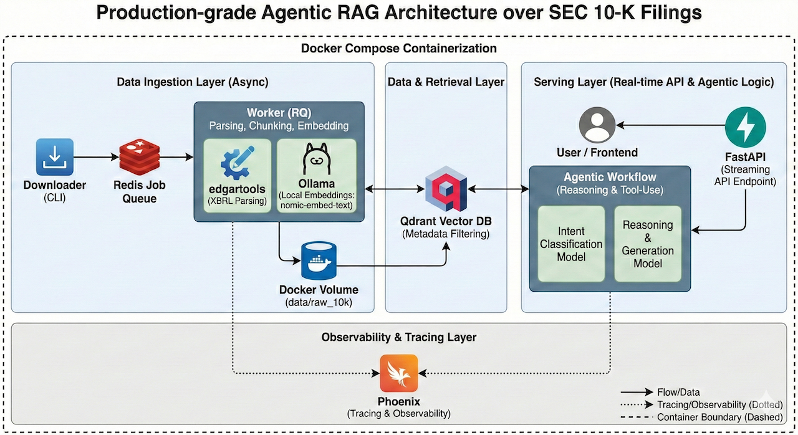

# 10K Agentic RAG  
**Production-grade Agentic Retrieval-Augmented Generation over SEC 10-K Filings**

## Project Goals & What This Repository Showcases

This project is a **publicly built, production-grade Agentic RAG system** that downloads, parses, chunks, embeds, and indexes SEC 10-K annual reports and all their amendments into a vector database, then powers a chatbot capable of answering complex financial, strategic, and risk-related questions.

The repository is designed to demonstrate three core aspects:

**a) Production-grade features** every serious RAG/Agentic system should have:  
- Reliable async ingestion pipeline with job queuing  
- Observability & tracing
- Vector DB with metadata filtering  
- FastAPI service with streaming responses  
- Automated parsing + intelligent chunking of SEC HTML filings  
- Indexing of both original 10-K and all amendments  
- Agentic workflow (tool-use + reasoning) for accurate financial Q&A  

**b) Systematic Error-analysis based AI Evals framework**  
***Phase 1:*** Collect a significant sample of traces and annotate errors → cluster annotations and identify failure modes → label errors according to failure modes → identify and fix root causes for failure modes (specification, generalization and comprehension)
***Phase 2:*** implement targeted automated evaluators (code-based, guardrails and LLM-as-Judge) → measure improvements → iterate.

**c) Leveraging AI tools for fast shipping**  
How I leverage Claude Code, Grok and other LLMs to navigate complex architectural trade-offs and generate production-grade code—accelerating the journey to high-quality deployment.

##  Architecture Overview

The system is fully containerized with **Docker Compose**:
Downloader (CLI) → Redis (Queue) → Worker (RQ)
↓
FastAPI (API)
↓
Qdrant (Vector DB)
↑
Ollama (Embeddings)
↑
Together.ai (LLM reasoning & generation)
data/raw_10k (Docker volume)
Phoenix (Tracing & Observability)

**Key components:**
- **Downloader** – CLI tool to fetch 10-K and amendment HTML from EDGAR
- **Worker (RQ)** – Asynchronous jobs for parsing, cleaning, chunking, embedding & upserting. The indexer uses the [edgartools](https://edgartools.readthedocs.io/en/latest/concepts/data-objects/) library for extracting data from 10-K filing files.
- **FastAPI** – REST + streaming API endpoint for chatbot queries
- **Qdrant** – High performance vector database with metadata filtering
- **Ollama** – Local embedding model (nomic-embed-text)
- **Together.ai** – High-quality LLMs for agentic reasoning and answer generation model    
    -   meta-llama/Llama-3.3-70B-Instruct-Turbo used as "large" model used for answering the user questions.
    -   meta-llama/Llama-3.2-3B-Instruct-Turbo used as "small" model for more simlpe tasks such as determine the question intent.
- **Phoenix** – Full tracing of retrieval, agent steps, and evaluation runs
- **Redis** – Job queue and result backend

## Trade-offs & Design Decisions

Here are the main trade-offs consciously made:

1. **Local embeddings (Ollama)**  
   → Since there are potentially hundreds of thousands of text chunks to embed during indexing and the user's query must also generate embeddings, this app adopts a local approach to minimize costs. Together.ai is used as a fallback if local computing resources for Ollama are insufficient or if an enterprise-grade embeddings provider is required.

2. **Qdrant as vectorDB**
  → It delivers production-grade performance and flexibility. It is fully open source, supports native hybrid search (dense + BM25), built-in rerankin and advanced fusion methods (e.g., Reciprocal Rank Fusion). Qdrant offers excellent documentation, a mature Python client and is significantly more production ready than simpler alternatives like Chroma or FAISS, with powerful metadata filtering, high-throughput queries, observability and reliability features essential for indexing and querying millions of document chunks. Also, the developer of this system is much more familiar with Qdrant than with any other vectorDB.

3. **Agentic workflow vs Simple RAG**  
   → Agentic (tool-calling + step-by-step reasoning) gives much higher accuracy on complex financial questions but increases latency and cost. Accuracy is chosen over costs. 

4. **XBRLparsing vs  HTML**  
   → Inline XBRL embeds structured tags directly into the HTML document, preserving the full human-readable narrative (including risk factors, MD&A, footnotes, and other text) while adding machine-readable accuracy for financial numbers. This hybrid approach avoids the loss of context common in pure HTML parsing (e.g., inconsistent table layouts, formatting issues) and eliminates the need for brittle custom parsers. Use XBRL tools to extract both tagged facts (e.g., revenue, risks) and the surrounding narrative text (via block tags or full document rendering), ensuring high fidelity for RAG applications.

5. **RQ + Redis vs Celery / Temporal / Prefect**  
   → Chose RQ for simplicity and lightweight footprint while still providing reliability, retries, and monitoring.

6. **Together.ai vs OpenAI / Anthropic / Grok**  
   → Together.ai offers better price/performance ratio + good open-source model selection. 

7. **Docker Compose vs Kubernetes**  
   → Docker Compose for developer experience and single-node production. Easy to scale to K8s later.

##  Build in Public – The Journey

I'm building this entire application **in public**, step by step, from the very first commit to a production-ready system.

My goal is to openly share:

- Real architecture decisions  
- Failure handling and refactors
- How I apply AI tools to ship fast without sacrificing quality  
- Systematic error analysis based AI evals to reach high accuracy

Follow the full build process:

- **X** → [Link to the main thread](https://x.com/pgBaretto)  
- **LinkedIn articles** → (https://www.linkedin.com/in/pgbaretto/recent-activity/all/)

Feel free to open issues, ask questions, or suggest features. This is a living project!